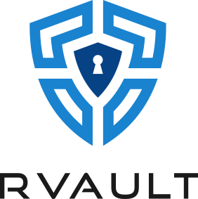

<p align="center"><a href="https://github.com/rmind/rvault"></a></p>

[](https://travis-ci.com/rmind/rvault)

**rvault** is a secure and authenticated store for secrets (passwords,
keys, certificates) and small documents.  It uses _envelope encryption_
with one-time password (OTP) authentication.  The vault can be operated
as a file system in userspace.

It is written in C11 and distributed under the 2-clause BSD license.
Available on: Linux and MacOS.

## Features

Key features and cryptography:
- Envelope encryption with one-time password (OTP) authentication.
- Mounting vault as a file system in userspace using
[FUSE](https://en.wikipedia.org/wiki/Filesystem_in_Userspace).
- Command line interface (CLI) to operate secrets (and auto-complete for keys).
- [scrypt](https://en.wikipedia.org/wiki/Scrypt)
[RFC 7914](https://tools.ietf.org/html/rfc7914)
for the key derivation function
([KDF](https://en.wikipedia.org/wiki/Key_derivation_function)).
- [AES 256](https://en.wikipedia.org/wiki/Advanced_Encryption_Standard) or
[Chacha20](https://en.wikipedia.org/wiki/ChaCha20) cipher with
[AE](https://en.wikipedia.org/wiki/Authenticated_encryption).
ISO/IEC 19772:2009 compliant.
- Authentication with the server using
[TOTP](https://en.wikipedia.org/wiki/Time-based_One-time_Password_algorithm)
([RFC 6238](https://tools.ietf.org/html/rfc6238)).
- On-the-fly [LZ4 compression](https://en.wikipedia.org/wiki/LZ4_(compression_algorithm)).

Lightweight code base, easy to audit, minimum dependencies, extensive tests,
[ASan](https://en.wikipedia.org/wiki/AddressSanitizer) and
UBSan enabled, supports different CPU architectures.

## Download

Download the latest packages from the [releases](https://github.com/rmind/rvault/releases/latest) page.

## Usage

Setup the vault and create the passphrase:
```shell
export RVAULT_SERVER="https://rvault.noxt.eu"
export RVAULT_PATH="/home/alice/vault"
mkdir "$RVAULT_PATH"
rvault create cba768f9-0efe-4b2c-879d-0925f52bdfd3
```

Scan the QR code, e.g. using the
[Google Authenticator](https://play.google.com/store/apps/details?id=com.google.android.apps.authenticator2) or
[Microsoft Authenticator](https://play.google.com/store/apps/details?id=com.azure.authenticator).
To mount the vault:
```shell
mkdir /home/alice/documents
rvault mount /home/alice/documents
```

Type `rvault -h` or see the **rvault(1)** manual page for more details.

## FAQ

#### Would my data be stored or processed remotely?

No, all data is stored and managed locally.  However, your envelope-encrypted
key is sent and stored on a remote server.  Because of the envelope encryption,
your real encryption key is opaque to the server.

#### Can I access my data without Internet connectivity?

You need to authenticate with a remote server in order to access your data,
therefore you need connectivity for that moment.  You can work offline once
authenticated.

#### What if my encrypted data and passphrase would get stolen?

It would still be insufficient to decrypt your data, unless the attacker
actively hacks into your device and reads the key that is resident in-memory.
However, such attack is much more sophisticated.

#### What if the remote server is hacked?

An attacker may retrieve the envelope-encrypted key, but it would still not
be possible to decrypt the data without obtaining your data and passphrase.

The attacker, however, could destroy the keys stored on the server-side.
Hence it is recommended to make a backup of the effective encryption key
for recovery and store it safely, e.g. print it on paper and lock it in a
physical safe.

#### What if I lost my authentication device?

A new authentication device can be set up instead, once the user is verified
using other reliable means (e.g. physical identification).

#### What if I would forget my passphrase?

It would be practically impossible to decrypt the data.  However, if you made
a backup of the effective encryption key, then you can recover your data.

## Caveats

**rvault** is not designed to be efficient with large files or large quantities
of data.  The files are generally expected to fit in physical memory.  The
application sacrifices performance in favour of security, data integrity and
simplicity.

## Dependencies

Mandatory:
- OpenSSL (>= 1.1) or
[libsodium](https://download.libsodium.org/doc/) or
[mbed TLS](https://en.wikipedia.org/wiki/Mbed_TLS)
- FUSE (libfuse and/or system support)
- libcurl

Optional:
- libedit
- sqlite3 3.23 or newer with `SQLITE_ENABLE_DESERIALIZE` enabled

## Building

To build from source:
* Regular build: `cd src && make`
* Debug build and running of tests: `make clean && make debug`

To build the packages:
* RPM (tested on RHEL/CentOS 8): `cd pkg && make rpm`
* DEB (tested on Debian 11): `cd pkg && make deb`
* MacOS pkg (tested on Catalina): `cd pkg && make osx-pkg`
